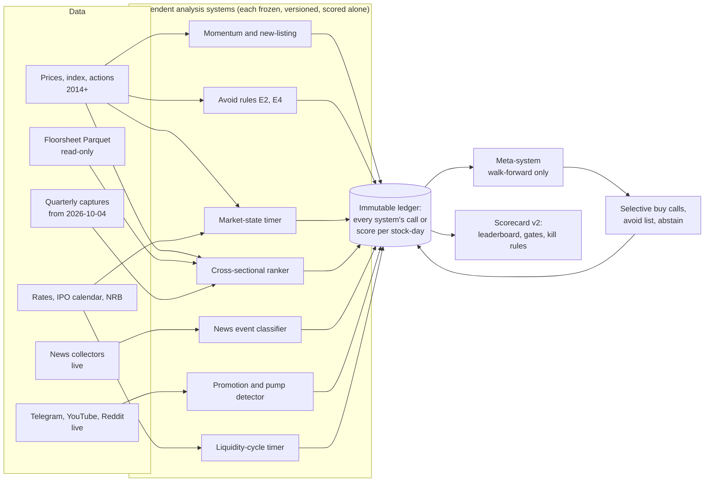

# Research Plan: widening the search

Written 2026-10-04. The goal is unchanged: a NEPSE system that says what to buy and what to avoid, with accuracy measured honestly under protocol `accuracy-v2`. The target is an edge of at least +8 points of win rate over the same-date baseline, on selective calls, with every other v2 gate passed.

## Where we stand

Every single signal tested so far has failed the v2 gate on the development window (2014-06-01 to 2025-01-19):

| Family | Result | Report |
| --- | --- | --- |
| Rule signals (technical) | No edge over the equal-weight universe | `docs/BACKTEST_RERUN.md` |
| Model v0 (momentum, new listing, avoid rules) | 0 PASS; best cell new_listing at 40 sessions, +8.75 points, penalized bound −6.4 | `docs/MATRIX_V2.md` |
| Broker flow, 5 hypotheses | All fail | `docs/BROKER_FLOW_RESULTS.md` |
| Events, 8 hypotheses | 6 fail; avoid rules E2 and E4 pass the event test | `docs/EVENT_RESULTS.md` |
| Earnings information, 6 hypotheses | Nothing passes | `docs/INFO_RESULTS.md` |
| ML models V2-V4.1, E1 (archived) | None passed its own gate | `docs/HONEST_STATUS.md` |

What this tells us:

- Single public signals have edges of about +2 points, not +8.
- The two avoid rules are the only components with a measured effect.
- The development window has been used many times, so every new test on it pays a larger multiple-testing penalty (*K* = versions × 104).

Two directions follow:

1. Combine the weak signals, conditioned on market regime, and keep only the confident calls (selectivity). This uses history we have.
2. Start collecting information that NEPSE's price and floorsheet data cannot contain, such as news, promotion and crowd attention. Most of it exists only from today, so collection must start early even though evidence will take more than a year.

## What the literature says

**Combining weak signals.**
- Rapach, Strauss and Zhou (2010) found that single return predictors are unstable out of sample, but a simple equal-weight combination of their forecasts beats the historical mean consistently. [RFS 2010](https://www.researchgate.net/publication/227465289_Out-of-Sample_Equity_Premium_Prediction_Combination_Forecasts_and_Links_to_the_Real_Economy)
- Stacking with a learned meta-model, chosen on an unseen validation block, can beat simple combinations, though not always. [Stacking a variety of models, J. Empirical Finance 2022](https://www.sciencedirect.com/science/article/abs/pii/S0927539822000342)
- **Lesson:** start with simple averaging, and earn the right to a learned meta-model.

**Meta-labeling.** López de Prado separates the *side* of a bet (from a primary model with high recall) from whether to act on it and how much (a secondary classifier). [Wikipedia summary](https://en.wikipedia.org/wiki/Meta-Labeling); [Singh and Joubert, "Does Meta-Labeling Add to Signal Efficacy?"](https://hudsonthames.org/wp-content/uploads/2022/04/Does-Meta-Labeling-Add-to-Signal-Efficacy.pdf)
- Reported improvements are in precision and drawdown, typically a few points. One practitioner summary reports a median lift of 5-6 points over the base rate. [summary](https://research.mental-momentum.ai/r/meta-labeling-triple-barrier-methods-lq4i7w)
- It is not a source of edge when the primary signal has none. [QuantConnect discussion](https://www.quantconnect.com/forum/discussion/14706/why-meta-labeling-is-not-a-silver-bullet/)
- **For us:** this is exactly the "selective calls" mechanism the target names. But a +2-point primary plus +5 from filtering is still a stretch to +8.

**Cross-sectional ML ranking.**
- Gu, Kelly and Xiu (RFS 2020): trees and neural nets beat linear models because of nonlinear interactions. The dominant predictors are momentum, liquidity and volatility. [NBER w25398](https://www.nber.org/papers/w25398)
- On Chinese A-shares, LightGBM roughly doubled OLS out-of-sample R² (2.13% against 0.95% a month), with liquidity and volatility the strongest predictors. [ACM 2025](https://dl.acm.org/doi/10.1145/3727353.3727490). Emerging-market evidence: [Machine learning and the cross-section of emerging market stock returns](https://www.researchgate.net/publication/369306172_Machine_learning_and_the_cross-section_of_emerging_market_stock_returns)
- Rankers break in deployment, so they need uncertainty gating. [When Alpha Breaks, 2026](https://arxiv.org/pdf/2603.13252)
- **Caution for NEPSE:** about 250-300 equities, a 1% round-trip cost, circuit limits and thin names. The archived V2-V4.1 work was a version of this, and it failed its gates.

**Regime conditioning.** Hidden-Markov and switching models report better risk-adjusted returns out of sample by detecting bull, bear and high-volatility states. [arXiv 2107.05535](https://arxiv.org/pdf/2107.05535); [HMM trading, MDPI](https://www.mdpi.com/2227-7072/6/2/36)
- With about 11 years and only a few NEPSE cycles, the number of regime episodes is tiny. Conditioning mostly helps by deciding when to *abstain*.

**LLM news sentiment.**
- Lopez-Lira and Tang find that GPT-4 headline scores predict next-day US returns, beating older sentiment methods. [arXiv 2304.07619](https://arxiv.org/pdf/2304.07619)
- The predictability:
  - lasts about **two days**;
  - is stronger in small stocks and after bad news;
  - is expected to **weaken as LLM use spreads** (the authors' own framework).
- The general base rate: anomaly returns fall 26% out of sample and 58% after publication. [McLean and Pontiff, JF 2016](https://onlinelibrary.wiley.com/doi/abs/10.1111/jofi.12365)
- **For us:** NEPSE is small, retail-driven and slow, which may stretch the window. But our shortest protocol horizon is 5 sessions, longer than the documented edge.
- **LLM look-ahead bias:** a model whose training data covers the test period "knows" what happened, so any LLM backtest on historical news is contaminated. Only live calls, or a model with a training cutoff before the test window, are clean.

**Social media.**
- Reddit and WallStreetBets activity predicts short-term volatility more than direction. [ResearchGate](https://www.researchgate.net/publication/396206198_Analyzing_the_Impact_of_Reddit_and_Twitter_Sentiment_on_Short-Term_Stock_Volatility)
- StockTwits beliefs are associated with *lower* future returns, so sentiment is often a contrarian signal. [Dumb money?, 2025](https://www.sciencedirect.com/science/article/pii/S2405918825000212); [Meme stock predictability](https://www.researchgate.net/publication/384545393_Sentiment_Social_Media_and_Meme_Stock_Return_Predictability)
- **For us:** promotion and attention should be tested as **avoid** signals first. That matches our only positive results, E2 and E4, which are both avoid rules.

**Pump-and-dump detection from Telegram.** The work is on crypto, where pumps are announced in Telegram groups:
- La Morgia et al. released over 1,000 confirmed pumps from 20 groups. [ACM TOIT](https://dl.acm.org/doi/fullHtml/10.1145/3561300)
- A real-time pipeline put the target coin in its top 5 in 55.8% of 43 pumps. [arXiv 2412.18848](https://arxiv.org/abs/2412.18848)
- PumpSense classified 280k posts with LightGBM (F1 0.79) and a transformer (F1 0.83). [arXiv 2605.09431](https://arxiv.org/abs/2605.09431v1)
- **For us:** NEPSE promotion happens in Telegram, YouTube and Facebook groups. Detected promotion would be an avoid or short-horizon exit signal, not a buy signal.

**Liquidity cycles in Nepal.**
- Nepali studies find NEPSE responds negatively to lending and deposit rates, with *lagged* liquidity effects. Margin lending fuelled the 2011 crash when NRB tightened. [NRB Economic Review](https://www.nrb.org.np/contents/uploads/2022/12/vol26-2_art2.pdf); [Impact of interest rate, TU](https://elibrary.tucl.edu.np/items/8e9bd3a3-3fb2-44f2-b716-4f45961e57ca); [Monetary policy and NEPSE](https://www.nepjol.info/index.php/EJON/article/download/80810/62134)
- IPO waves can divert retail cash from the secondary market. [Outlook Business on India](https://www.outlookbusiness.com/markets/indias-ipo-frenzy-has-lost-touch-with-the-stock-market); [Liquidity and IPO underpricing](https://www.sciencedirect.com/science/article/abs/pii/S0378426613003622)
- **For us:** this is a market-timing (abstain) input. With monthly data there are few independent observations, so its value is in a regime gate, not a stock picker.

**Terms of the platforms we would collect from:**
- **Telegram API terms** prohibit "using, accessing or aggregating data obtained from the Telegram platform to train, fine-tune or otherwise engage in the development, enhancement or deployment of artificial intelligence, machine learning models and similar technologies". [core.telegram.org/api/terms](https://core.telegram.org/api/terms)
- **YouTube API Developer Policies** limit storage of non-authorized API data to **30 days**, after which it must be deleted or refreshed. [Developer Policies](https://developers.google.com/youtube/terms/developer-policies). `commentThreads.list` costs 1 unit out of a 10,000-unit daily quota. [quota](https://developers.google.com/youtube/v3/determine_quota_cost)
- **Reddit's Data API** is free for non-commercial use at 100 queries a minute with OAuth. Since 2026 every developer needs approval, and commercial use needs a paid contract. [summary](https://www.redditapis.com/blogs/reddit-data-api-2026)

## Ranked ideas

Column definitions:

- **EV**: expected value toward the +8-point target, with the reasoning.
- **Data**: H means the history exists locally now; L means live-only, accruing from the day collection starts.
- **Evidence**: the earliest *v2 evidence*. A development-window replay can kill an idea within days. Only live calls can give a claim. At 5 sessions a claim needs at least 40 independent windows, which is at least 240 sessions (about 1.05 years) if calls occur in every window.
- **Cost**: engineering effort plus money.
- **Risk**: legal or terms risk.

| # | Idea | EV | Data | Evidence | Cost | Risk |
| ---: | --- | --- | --- | --- | --- | --- |
| 1 | **Meta-system over existing components.** Momentum, new listing and E2/E4 avoid flags plus regime features feed a walk-forward meta-labeler that decides which primary calls to keep | Medium. The only route that uses everything we have, and selectivity is what the target asks for. Literature lift is a few points; the components have about +2 | H (2014-2025-01) | Replay verdict within days (pays *K*); live claim ≥ 1.5 years at 5 sessions | Low (code only) | None |
| 2 | **Cross-sectional LightGBM ranker**: price, volume, volatility, liquidity, circuit, broker-concentration and point-in-time fundamentals features; purged walk-forward; top-*k* with an abstain threshold | Medium-low. These are the strongest documented predictors worldwide, but V2-V4.1 (XGBoost) failed here | H | Replay within 1-2 weeks; live as above | Low-medium (installing `lightgbm` and `scikit-learn`) | None |
| 3 | **Regime-conditional abstain gate**: market state, breadth, turnover regime and rate regime decide when *no* buy call is made | Medium as a component. Raises the edge by skipping bad regimes, but with few regime episodes power is low | H | Replay within days; few independent regimes | Low | None |
| 4 | **Promotion and pump detection as an avoid signal** (Telegram, YouTube, news "tips"), with a pump flag from LLM classification | Medium-high if NEPSE pumps are announced publicly, which is unknown. Avoid signals are the only kind that has worked for us | L | Avoid observations at 20 sessions; ≥ 2-4 years at the observed rates of E2/E4-like events | Medium; LLM classification about $5-30 a month | **High for Telegram** (API terms forbid ML use of the data, see below); medium for YouTube (30-day storage) |
| 5 | **News-portal event classification**: company-specific news, regulatory notices, NRB circulars; LLM labels event type and direction | Medium. Event information is real, but documented LLM edges last about 2 days and our shortest horizon is 5 sessions | **Partly H**: Merolagani news to the minute since about 2016; Sharesansar company news with dates. **But** an LLM backtest is contaminated by look-ahead, so clean evidence is L | Live ≥ 1.05 years at 5 sessions | Medium; LLM about $10-50 a month for live volume; a historical backfill is a one-off of roughly $50-300 | Low-medium (site terms not read; robots allow) |
| 6 | **IPO, FPO and rights cash-demand timer**: rupees demanded by open issues (units × price) relative to recent turnover, as an abstain feature | Low-medium. A plausible liquidity drain in a retail market; a market-level timer only | H: `ipo_calendar` 981 issues with dates since 2011 | Replay within days; few independent episodes | Low | None |
| 7 | **Rate and liquidity cycle**: T-bill and interbank rates (have them monthly since FY 2073/74); NRB credit-to-deposit, margin-loan and policy-rate data (need collecting) | Low-medium. Real but lagged and monthly, with about 110 observations | H for rates; margin lending needs collection from NRB statistics (history exists in NRB publications) | Replay within weeks; low power | Medium (NRB PDF and Excel parsing) | None (government data) |
| 8 | **Floorsheet manipulation footprints**: broker concentration spikes, circular trades and one-broker accumulation before upper-circuit runs, used as avoid flags | Low-medium. Broker flow failed as a *buy* signal; the avoid side was never tested | H: Parquet 2014-2025-01 (read-only) | Replay within 1-2 weeks | Medium | None |
| 9 | **Attention**: YouTube comment volume and mentions per symbol | Low-medium. Attention predicts volatility more than direction; maybe contrarian | L (YouTube allows video-comment history, but that is not point-in-time) | Live ≥ 1.05 years | Low (free quota) | Medium: 30-day storage limit |
| 10 | **Promoter lock-in expiry and supply calendar**: promoter-share unlocks after the lock-in and promoter sale notices | Low-medium. Supply shocks are a known effect; the NEPSE size is unknown | Partly H (`promoter_holding`, announcements since 2011) | Replay within weeks (needs event table) | Medium | None |
| 11 | **Seasonal liquidity**: Dashain/Tihar, fiscal-year end (Asar), bonus and AGM season | Low. Few cycles (11 per season), very weak power | H | Replay within days | Low | None |
| 12 | **Reddit attention** (r/NepalStock and others) | Low. Small community | L (listing API reaches about 1,000 recent posts; not point-in-time) | Live ≥ 1.05 years | Low | Low-medium (approval needed since 2026, non-commercial only) |
| 13 | **Google Trends attention per symbol** | Low. NEPSE search volume is near the floor for most names | H but revised and sampled, so not point-in-time | Replay possible, contaminated | Low | Medium (no official API) |
| 14 | **Cross-market spillover**: India Nifty and remittance flows as a regime input | Low. NEPSE is largely closed to foreign capital | H (remittance monthly; Nifty public) | Replay within days | Low | Low |

**Ideas that need history we do not have:**
- 4, 9 and 12 have none.
- 5 has text history, but any LLM-derived backtest is look-ahead-contaminated.
- 7's margin-lending series has to be collected.
- 13 has no point-in-time history.

**Ideas that can be killed this month on history:** 1, 2, 3, 6, 8, 10, 11 and 14. Each one run on the development window raises *K*, so the plan below caps the number of new pre-registered replay hypotheses at **12** for the next round.

## Why the target is hard

- At 5 sessions a claim needs 40 independent windows, which is at least a year of live calls. At 20 sessions it is about 3.5 years.
- No result from the development window, however good, is a live claim. After the many tests already run on it, a replay PASS would have to clear a penalized bound at α = 0.10 / *K* with *K* ≥ 624.
- Documented edges decay after publication and as LLMs spread. Anything that works will need monitoring, and the v2 kill rules provide that.

## Final architecture

Rules of the architecture:

1. **Each analysis system is a separate, frozen, versioned model.** Its outputs are written to the ledger before the next open, and it is scored on its own. A system that changes is a new version.
2. **The meta-system sees only ledger rows written before the decision date.** It is trained **walk-forward only**: refit on an expanding window that ends at least *h* + 1 sessions before the first prediction (purge plus embargo), and never on data at or after the decision date. Its inputs are the systems' scores and flags plus regime features. Its output is keep or skip per primary call, an avoid list and a market abstain flag.
3. **The meta-system starts simple.** First an equal-weight vote of system flags (Rapach-style). Second, a logistic meta-labeler. Third, only if the second earns it on live data, gradient boosting.
4. **Live-only systems (A5, A6) enter the meta-system only after they have their own live record.** The meta-system's training window starts when their data starts, and it must never backfill their scores.
5. **Every layer goes through the same scorecard v2.** The meta-system is just another strategy in the ledger with its own model version, so its +8-point claim is measured on its own live calls.

## Plan for the next phases

- **Now (this commit series):**
  - Phase B: freeze six paper bots from what exists, and declare them before any live day.
  - Phase C: start the live collectors so that A5 and A6 begin accruing.
- **Next:** pre-register up to 12 replay hypotheses (from ideas 1, 2, 3, 6, 8 and 10) with fixed features, windows and the v2 gate, then run them once on the development window. Anything that passes is still only a live hypothesis.
- **After at least 240 live sessions:** first possible 5-session claims. The meta-system is first trained on live ledger rows when every component has at least 120 sessions of its own record.
